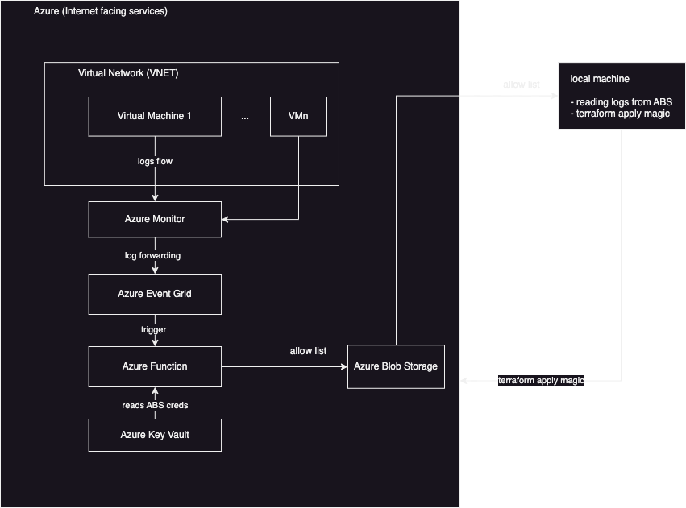
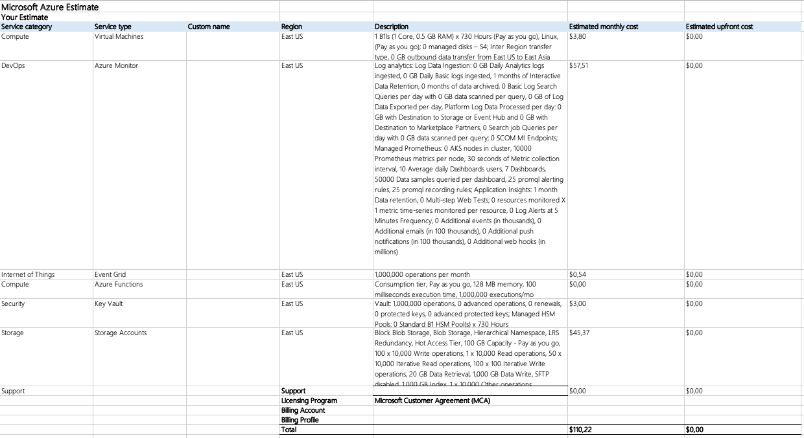

# Execution notes

## Summary
<!-- TOC depthTo:4 -->

- [Execution notes](#execution-notes)
    - [Summary](#summary)
    - [Project Overview](#project-overview)
    - [Expected outcomes](#expected-outcomes)
    - [Execution plan](#execution-plan)
    - [Technical details](#technical-details)
        - [Solution diagram](#solution-diagram)
        - [Execution](#execution)
            - [Getting my Azure account](#getting-my-azure-account)
            - [Local environment setup](#local-environment-setup)
            - [Which infra region to select](#which-infra-region-to-select)
            - [Estimating solution cost](#estimating-solution-cost)
            - [Architect for high volume/low volume](#architect-for-high-volumelow-volume)
            - [Upload path semantics](#upload-path-semantics)
            - [Cost estimates](#cost-estimates)
    - [Challenges & Solutions](#challenges--solutions)
    - [Security](#security)

<!-- /TOC -->

## Project Overview
The goal of this project is to evaluate my solution building skills while having fun at it.
Displaying thoroughness and innovation as well as cost and security impacts is also one of the key deliverables.

We'll use [Terraform](https://www.terraform.io/) to automate the deployment of the following resources in [Azure](https://portal.azure.com/#home):
- [ ] VNET (incl. Network Security Group)
- [ ] VM within that VNET
- [ ] Azure Blob Storage (ABS)
- [ ] Azure key vault (AKV)
- [ ] Azure function (AF)

VM logs are to be retrieved via the created Azure function (running on the same VNET ought to do it), then the key to access Azure blob storage is to be retrieved using Azure key vault then simply send these logs (WARNING and ERROR only) to Azure Blob Storage.

## Expected outcomes
- working (cost effective) solution in Azure.
- 30 minute presentation (slide deck at [presentation](./presentation))

## Execution plan
- [x] read main `readme.md`.
- [x] mock solution diagram.
- [x] read AWS example provided by Gabriel (it may provide insights and shortcuts I haven't thought of).
- [x] local setup. [detailed task](#local-environment-setup). Tested with Terraform for creating/destroying resource group in Azure.
- [x] define upload path semantics to ABS.
- [x] cost estimate calculations for the proposed solution (top it at 200 USD)
- [ ] refer to [Terraform azurerm docs](https://registry.terraform.io/providers/hashicorp/azurerm/latest/docs), so understand the input I need to provide to my Terraform script. Perhaps visit some of the resources in the Azure Portal UI to see if I get any additional contextual info that can help me decide how to configure each resource.
- [ ] see what I can get out of Azure function. I am guessing I can drag drop my way there to do fun stuff for me.
- [ ] note down challenges and solutions as I progress.
- [ ] do blob reading to local terminal.
- [ ] create slide deck.
- [ ] contact Gabriel and Hemanth for follow up call.

## Technical details
### Solution diagram


### Execution
#### Getting my Azure account
- Signed up for a 200 USD free starter account on Azure.

#### Local environment setup
I need to setup my own account with Azure then setup macOS to be able to talk to Azure so that `Terraform` is able to actually go an deploy resources for me there.
Before I can Terraform anything, I should create an Azure Resource Group which is where all my resource will end up.
**IMPORTANT**: remember to destroy the resource group in its entirety at the end of the exercise so it stops charging me.

[reference](https://developer.hashicorp.com/terraform/tutorials/azure-get-started/azure-build).

With Azure CLI installed:
```bash
az login
# follow the auth flow and retrieve your account ID then
export SUBS_ID=[THE_ACTUAL_ID_VALUE]
az account set --subscription $SUBS_ID

# Setup a Service Principal so that Terraform can act on my behalf
az ad sp create-for-rbac --role="Contributor" --scopes="/subscriptions/$SUBS_ID"

# Setting up local Terraform envs
 export ARM_CLIENT_ID="<APPID_VALUE>"
 export ARM_CLIENT_SECRET="<PASSWORD_VALUE>"
 export ARM_SUBSCRIPTION_ID="<SUBSCRIPTION_ID>"
 export ARM_TENANT_ID="<TENANT_VALUE>"
```

#### Which infra region to select
- https://azure.microsoft.com/en-us/explore/global-infrastructure
- about 60 regions;
- top most grouping is named "geography";
- a region is a subgroup inside of a geography
- availability zones can be used to provide single digit millisecond fail over within a region.
- reduce network latency by providing resources closer to users. Me in this case.
- data compliance regulation requirements: none for this exercise.
- products by region page shows which services are available per region: we want to make it so that all the resources we need are within the same region. I remember network traffic is costly.
- [this filter](https://azure.microsoft.com/en-us/explore/global-infrastructure/products-by-region/?products=functions,storage,virtual-network,virtual-machines,key-vault&regions=non-regional,brazil-south,brazil-southeast) states **Brazil South** is a sweet spot for me.
- Looking at the price calculator (next section), I noticed **Central US** has cheaper VM's.

#### Estimating solution cost
- Azure pricing calculator
- It looks like I can have the full free tier \o/: https://azure.microsoft.com/en-us/free/#all-free-services
    - 750 hours Linux VM
    - ABS 5GB with locally redundant storage
    - Azure Functions: 1 million requests
    - Azure Event Grid: 100k operations per month. I can use the observer pattern and subscribe to logs as they go.

#### Architect for high volume/low volume
I'll consider this one particular scenario is low volume, so I'll not use Azure Event Hub and will simply got straight from Azure Monitor to Event Grid instead.
Looking at the overall architecture and for the purpose of the exercise, I believe this would make it easier to simply attach new VM's to Azure Monitor.
Azure Function's sole purpose is log writing without having to worry how the events got there.
I could of course, simply write a piece of code that reads and parses code straight from the VM, but that'd probably be harder to maintain/deploy.

#### Upload path semantics
In order to make it easier to identify and filter in Azure Blob Storage, what is the VM that logged a particular blob, we'll use the following upload path:
> `<bucket-id>/<resource-group>/<vm-identifier>/somelogfile.log`

PS: The Azure Subscription ID is not considered necessary as the solution itself is assumed to live within the boundaries of a single subscription and resource group. If that changes then we need to adapt 😉.

#### Cost estimates
Using [Azure Pricing Calculator](https://azure.microsoft.com/en-us/pricing/calculator/):
- VM: using the cheapest I can find since its sole purpose is to generate logs for the exercise. Selected: B1ls at USD 0.0062/hour
- Azure Monitor: Do I get security alerts for free in case I mess up my settings?
- Azure Event Grid: routing events magically for Azure stuff. Like Kafka it seems. It also allows filtering, but I suspect I'll save some `$$$` if I can filter events on Azure Monitor, outbound to Event Grid.
- Azure functions: ball parking at about 1 million calls/month.
- Storage: selected the hot storage flavor with local redundancy only as I don't have to worry about increased costs when accessing the data. Again, for the purposes of this exercise this is perhaps not soooo relevant.

PS: I noticed `East US` resources are cheaper.

This is how it ended up like. I don't think I'll be using all of it, and since it is within my 200 USD limit I'll go for it.




> More soon...

## Challenges & Solutions
1. How to generate `WARNING/ERROR` type logs in case everything goes smoother than usual.
1. Latency: how frequent do we trigger log retrieval? Pooling or event-based? **ANS.:** The architecture using Azure Monitor and Event Grid makes it event-based. Event-Grid triggers a call to the Azure Function that effectively logs an entry to Azure Blob Storage.
1. How to ensure we don't send a gargantuan amount of logs to blobs, so I don't have to sell my kidney to pay for it. 😅
1. Do we write a pipeline that does `terraform apply` upon receiving updates on this repo? ANS.: Perhaps it will be a bit messy integrating SAP's Github.tools to AzureDevOps? Let's try local Terraform only.
1. Define upload path semantics. ANS.: done [here](#upload-path-semantics).
1. What happens if they ask me to start sending logs from a new VM? Can I have it so, I can simply append the new VM in the list and magic happens? Upload paths should allow VM identification for effective blob retrieval.
1. Encoding of logs before sending so they don't get messed up because of special formatting.
1. How can I detect if the VM was shutdown and logs are no longer flowing?
1. How does an Azure Function receive input?

## Security
- restrict VNET access via NSG.
- setup AKV in a way that we use the secret to access it in a secure fashion. I remember something like being able to have Azure recognize an app instead of using the likes of a private key or secret-based authentication.