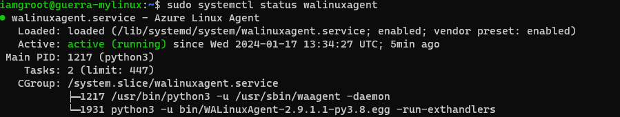
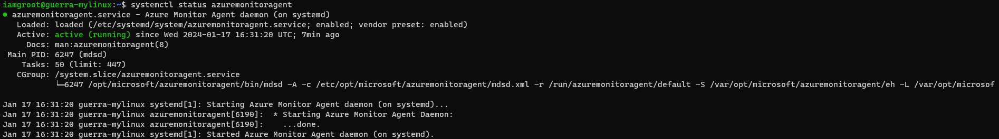

# Execution notes

## Summary
<!-- TOC depthto:4 -->

- [Execution notes](#execution-notes)
    - [Summary](#summary)
    - [Project Overview](#project-overview)
    - [Expected outcomes](#expected-outcomes)
    - [Execution plan](#execution-plan)
    - [Technical details](#technical-details)
        - [Solution diagram](#solution-diagram)
        - [Execution](#execution)
            - [Getting my Azure account](#getting-my-azure-account)
            - [Local environment setup](#local-environment-setup)
            - [Which infra region to select](#which-infra-region-to-select)
            - [Estimating solution cost](#estimating-solution-cost)
            - [Architect for high volume/low volume](#architect-for-high-volumelow-volume)
            - [Upload path semantics](#upload-path-semantics)
            - [Cost estimates](#cost-estimates)
            - [Terraform Plugin issues](#terraform-plugin-issues)
            - [Virtual Machine](#virtual-machine)
    - [Challenges & Solutions](#challenges--solutions)
    - [Security](#security)

<!-- /TOC -->

## Project Overview
The goal of this project is to evaluate my solution building skills while having fun at it.
Displaying thoroughness and innovation as well as cost and security impacts is also one of the key deliverables.

We'll use [Terraform](https://www.terraform.io/) to automate the deployment of the following resources in [Azure](https://portal.azure.com/#home):
- [ ] VNET (incl. Network Security Group)
- [ ] VM within that VNET
- [ ] Azure Blob Storage (ABS)
- [ ] Azure key vault (AKV)
- [ ] Azure function (AF)

VM logs are to be retrieved via the created Azure function (running on the same VNET ought to do it), then the key to access Azure blob storage is to be retrieved using Azure key vault then simply send these logs (WARNING and ERROR only) to Azure Blob Storage.

## Expected outcomes
- working (cost effective) solution in Azure.
- 30 minute presentation (slide deck at [presentation](./presentation))

## Execution plan
- [x] read main `readme.md`.
- [x] mock solution diagram.
- [x] read AWS example provided by Gabriel (it may provide insights and shortcuts I haven't thought of).
- [x] local setup. [detailed task](#local-environment-setup). Tested with Terraform for creating/destroying resource group in Azure.
- [x] define upload path semantics to ABS.
- [x] cost estimate calculations for the proposed solution (top it at 200 USD)
- [ ] refer to [Terraform azurerm docs](https://registry.terraform.io/providers/hashicorp/azurerm/latest/docs), so understand the input I need to provide to my Terraform script. Perhaps visit some of the resources in the Azure Portal UI to see if I get any additional contextual info that can help me decide how to configure each resource.
- [ ] see what I can get out of Azure function. I am guessing I can drag drop my way there to do fun stuff for me.
- [ ] note down challenges and solutions as I progress.
- [ ] do blob reading to local terminal.
- [ ] create slide deck.
- [ ] contact Gabriel and Hemanth for follow up call.

## Technical details
### Solution diagram


### Execution
#### Getting my Azure account
- Signed up for a 200 USD free starter account on Azure.

#### Local environment setup
I need to setup my own account with Azure then setup macOS to be able to talk to Azure so that `Terraform` is able to actually go an deploy resources for me there.
Before I can Terraform anything, I should create an Azure Resource Group which is where all my resource will end up.
**IMPORTANT**: remember to destroy the resource group in its entirety at the end of the exercise so it stops charging me.

[reference](https://developer.hashicorp.com/terraform/tutorials/azure-get-started/azure-build).

With Azure CLI installed:
```bash
az login
# follow the auth flow and retrieve your account ID then
export SUBS_ID=[THE_ACTUAL_ID_VALUE]
az account set --subscription $SUBS_ID

# Setup a Service Principal so that Terraform can act on my behalf
az ad sp create-for-rbac --role="Contributor" --scopes="/subscriptions/$SUBS_ID"

# Setting up local Terraform envs
 export ARM_CLIENT_ID="<APPID_VALUE>"
 export ARM_CLIENT_SECRET="<PASSWORD_VALUE>"
 export ARM_SUBSCRIPTION_ID="<SUBSCRIPTION_ID>"
 export ARM_TENANT_ID="<TENANT_VALUE>"
```

#### Which infra region to select
- https://azure.microsoft.com/en-us/explore/global-infrastructure
- about 60 regions;
- top most grouping is named "geography";
- a region is a subgroup inside of a geography
- availability zones can be used to provide single digit millisecond fail over within a region.
- reduce network latency by providing resources closer to users. Me in this case.
- data compliance regulation requirements: none for this exercise.
- products by region page shows which services are available per region: we want to make it so that all the resources we need are within the same region. I remember network traffic is costly.
- [this filter](https://azure.microsoft.com/en-us/explore/global-infrastructure/products-by-region/?products=functions,storage,virtual-network,virtual-machines,key-vault&regions=non-regional,brazil-south,brazil-southeast) states **Brazil South** is a sweet spot for me.
- Looking at the price calculator (next section), I noticed **Central US** has cheaper VM's.

#### Estimating solution cost
- Azure pricing calculator
- It looks like I can have the full free tier \o/: https://azure.microsoft.com/en-us/free/#all-free-services
    - 750 hours Linux VM
    - ABS 5GB with locally redundant storage
    - Azure Functions: 1 million requests
    - Azure Event Grid: 100k operations per month. I can use the observer pattern and subscribe to logs as they go.

#### Architect for high volume/low volume
I'll consider this one particular scenario is low volume, so I'll not use Azure Event Hub and will simply got straight from Azure Monitor to Event Grid instead.
Looking at the overall architecture and for the purpose of the exercise, I believe this would make it easier to simply attach new VM's to Azure Monitor.
Azure Function's sole purpose is log writing without having to worry how the events got there.
I could of course, simply write a piece of code that reads and parses code straight from the VM, but that'd probably be harder to maintain/deploy.

#### Upload path semantics
In order to make it easier to identify and filter in Azure Blob Storage, what is the VM that logged a particular blob, we'll use the following upload path:
> `<bucket-id>/<resource-group>/<vm-identifier>/somelogfile.log`

PS: The Azure Subscription ID is not considered necessary as the solution itself is assumed to live within the boundaries of a single subscription and resource group. If that changes then we need to adapt 😉.

#### Cost estimates
Using [Azure Pricing Calculator](https://azure.microsoft.com/en-us/pricing/calculator/):
- VM: using the cheapest I can find since its sole purpose is to generate logs for the exercise. Selected: B1ls at USD 0.0062/hour
- Azure Monitor: Do I get security alerts for free in case I mess up my settings?
- Azure Event Grid: routing events magically for Azure stuff. Like Kafka it seems. It also allows filtering, but I suspect I'll save some `$$$` if I can filter events on Azure Monitor, outbound to Event Grid.
- Azure functions: ball parking at about 1 million calls/month.
- Storage: selected the hot storage flavor with local redundancy only as I don't have to worry about increased costs when accessing the data. Again, for the purposes of this exercise this is perhaps not soooo relevant.

PS: I noticed `East US` resources are cheaper.

This is how it ended up like. I don't think I'll be using all of it, and since it is within my 200 USD limit I'll go for it.


#### Terraform Plugin issues
It turns out that using such a dated version of the `azurerm` Terraform plugin became rather problematic. 3.55.0 (about 10 months old) was the only one not giving me a hard time on macOS.

#### Virtual Machine
Using `az monitor diagnostic-settings categories list --resource [GIGANTIG_VM_IDENTIFIER]` I was able to tell my VM is currently only providing me with `Metrics` events.
I want more!

I found something called [Azure Monitor Agent](https://learn.microsoft.com/en-us/azure/azure-monitor/agents/agents-overview) which I need to enable in order to be able to send the more fun telemetry to Azure Monitor.

Since I am done for the day, I'll deallocate the VM to save costs:
```bash
az vm stop --name guerra-mylinux --resource-group guerra-VmLoggingRg
az vm deallocate --name guerra-mylinux --resource-group guerra-VmLoggingRg
```

##### Enabling VM extension to monitor
I found the list of available extensions at `az vm extension image list --location=eastus --publisher=Microsoft.Azure.Monitor --output table`. I also found the list of [compatible linux dependency agent versions](https://learn.microsoft.com/en-us/azure/azure-monitor/vm/vminsights-dependency-agent-maintenance#dependency-agent-linux-support), and [compatible AMA linux machines](https://learn.microsoft.com/en-us/azure/azure-monitor/agents/agents-overview#linux), so I reverted to UbuntuServer 18.04 as it checks all the boxes.

Checked that `waagent` is up and running:



Checking available extensions on `eastus` that could be interesting...
```yaml
- name: AzureMonitorLinuxAgent
  publisher: Microsoft.Azure.Monitor
  version: 1.29.4
```

AMA Extension installed successfully, but missing  Guest Configuration Service (GCS) details. Figuring out which settings to provide is proving to be difficult as the docs in Terraform don't have anything specific for VM logs. I believe if I was using the UI then it'd likely be much easier. Perhaps I can do that and then check the Extensions menu on the VM and copy settings from there to Terraform?

https://learn.microsoft.com/en-us/azure/azure-monitor/agents/azure-monitor-agent-manage?tabs=azure-cli
https://learn.microsoft.com/en-us/azure/azure-monitor/agents/azure-monitor-agent-data-collection-endpoint?tabs=PowerShellWindows

After deleting the AMA extension in Azure UI and 'terraform apply', it got provisioned successfully. I can't explain why though.

My new idea: Do the provisioning in the UI to have it work. Or via Azure CLI (since the UI doesn't display all available extensions) and SSH into the VM to peek at the config file for `waagent` at `/etc/waagent.conf`. I saved it to [waagent.conf](./inspect/waagent.conf), but it doesn't look like anything I expected. It should have a pointer to my Analytics Workspace somewhere. I'll try again using `az cli` to provision and inspect the same file again:

```bash
az vm extension set --name AzureMonitorLinuxAgent --publisher Microsoft.Azure.Monitor --ids <vm-resource-id> --enable-auto-upgrade true
```

It also worked, but the config file looks exactly the same. Perhaps I need to configure data collection points after even enabling them as the Azure Portal config does not seem to populate anything on Analytics Workspace either. Looking at the data collection UI, I see I have no data collection endpoints available yet, so perhaps this is what I need to enable next.



I couldn't find the workspace id anywhere in `az vm extension show --resource-group guerra-VmLoggingRg --vm-name guerra-mylinux --name AzureMonitorLinuxAgent`. I wonder if it would appear if I had used my terraform script that provides it to the extension. It does!

```json
{
  "autoUpgradeMinorVersion": false,
  "enableAutomaticUpgrade": false,
  "forceUpdateTag": null,
  "id": "/subscriptions/03c70407-f5f1-46ef-ae0a-ad11011535b7/resourceGroups/guerra-VmLoggingRg/providers/Microsoft.Compute/virtualMachines/guerra-mylinux/extensions/AzureMonitorLinuxAgent",
  "instanceView": null,
  "location": "eastus",
  "name": "AzureMonitorLinuxAgent",
  "protectedSettings": null,
  "protectedSettingsFromKeyVault": null,
  "provisionAfterExtensions": null,
  "provisioningState": "Succeeded",
  "publisher": "Microsoft.Azure.Monitor",
  "resourceGroup": "guerra-VmLoggingRg",
  "settings": {
    "workspaceId": "f4a01be1-2c31-422b-bbef-78e86da34134",
    "workspaceKey": "REDACTED"
  },
  "suppressFailures": false,
  "tags": {},
  "type": "Microsoft.Compute/virtualMachines/extensions",
  "typeHandlerVersion": "1.29",
  "typePropertiesType": "AzureMonitorLinuxAgent"
}
```

#### Data collection rules
It seems that this is the next element we need to terraform: [monitor_data_collection_rule](https://registry.terraform.io/providers/hashicorp/azurerm/latest/docs/resources/monitor_data_collection_rule).

Ok, I setup collection rules and streams/destinations, but still see no logs flowing despite having included even INFO like events. I also see no Linux Agents on my Analytics Workspace. I see it has instructions to setup data collection rules, but that's already created. I am thinking this is an issue with the agent not having access to send the data where we need.

Maybe try to install AMA extension on the VM via a Custom Script? The Terraform docs show how to execute a custom script and the Azure docs show how to install the AMA extension.

```
UPDATE: I am thinking my VM can't read the Azure Monitor endpoints due to the NSG rules:
global.handler.control.monitor.azure.com
<virtual-machine-region-name>.handler.control.monitor.azure.com (example: westus.handler.control.monitor.azure.com)
<log-analytics-workspace-id>.ods.opinsights.azure.com (example: 12345a01-b1cd-1234-e1f2-1234567g8h99.ods.opinsights.azure.com)
(If you use private links on the agent, you must also add the dce endpoints).
```

Next step: verify if the system assigned account to the data collection setup is failing us. Work with an user defined one.

PS: The manual rule I created following [this doc](https://learn.microsoft.com/en-us/azure/azure-monitor/agents/data-collection-syslog#configure-syslog-on-the-linux-agent) looks exactly like the rule I created via Terraform. The tutorial does mention a 20 minute wait until some action is perceived, so I'll leave the VM running overnight. I saw no Linux Agents detected in Azure Portal.

**JACKPOT!**: I was missing the linux kind on my Terraform script. Perhaps it's what was keeping my AMA logs from showing up. That and the network rules of course! I matched facility names and log levels as the working log to make sure I can now Terraform this stuff. 🤞

> More soon...

## Challenges & Solutions
1. How to generate `WARNING/ERROR` type logs in case everything goes smoother than usual.
1. Latency: how frequent do we trigger log retrieval? Pooling or event-based? **ANS.:** The architecture using Azure Monitor and Event Grid makes it event-based. Event-Grid triggers a call to the Azure Function that effectively logs an entry to Azure Blob Storage.
1. How to ensure we don't send a gargantuan amount of logs to blobs, so I don't have to sell my kidney to pay for it. 😅
1. Do we write a pipeline that does `terraform apply` upon receiving updates on this repo? ANS.: Perhaps it will be a bit messy integrating SAP's Github.tools to AzureDevOps? Let's try local Terraform only.
1. Define upload path semantics. ANS.: done [here](#upload-path-semantics).
1. What happens if they ask me to start sending logs from a new VM? Can I have it so, I can simply append the new VM in the list and magic happens? Upload paths should allow VM identification for effective blob retrieval.
1. Encoding of logs before sending so they don't get messed up because of special formatting.
1. How can I detect if the VM was shutdown and logs are no longer flowing?
1. How does an Azure Function receive input?
1. Issue with Terraform latest `azurerm` plugin. ANS.: Using version 3.55.0. It's been quite tedious to quickly change provider version. I can't explain why newer versions fail to be able to register with Azure. One can disable registration, but I just avoided doing that as it seems it can mess up my Azure thingy.
1. Difficulty enabling the VM extension required to attach VM to Azure Analytics Workspace. ANS.: further reading into Azure Monitoring Agent docs and enablement of public IP to VM to be able to SSH into it.
1. Blob storage in Azure allowed `anonymous` access when visiting the Portal UI despite the fact I had explictly set it to `private` mode. I found this setting had been overriden by the storage account config. That fixed the issue.

## Insights
- Network Security Groups used from the get go in Azure grant you default security settings. E.g.: I wasn't able to SSH into my VM even after I exposed it via a publicly accessible IP address. Only by adding my local PC to the list of security rules, I was able to do that.
- running `grep . /sys/devices/system/cpu/vulnerabilities/*` will give me an output of vulnerable vs. mitigated OS level vulnerabilities. I wonder if these would show in Azure Security Monitor somewhere.
- For some reason I was only able to install AMA on Azure when providing major and minor version of the extension (e.g.: 1.29 instead of 1.29.4).
- Terraform is great, but the way it works it allows a lot of configuration parameters to be ommited which causes them to be set to default values within Azure. I understand this adds a lot of flexibility, but then we have an incomplete picture of what a resource looks like when reviwing the corresponding terraform file that provisioned it.

## To do's:
- TODO: [Docs on storage accounts](https://registry.terraform.io/providers/hashicorp/azurerm/latest/docs/resources/storage_account) indicate that we can apply `network_rules` to allow list specific public IP's.
- TODO: public_network_access_enabled = true revisit this for `azurerm_monitor_data_collection_endpoint`.
- TODO: potential failure: f4a01be1-2c31-422b-bbef-78e86da34134.ods.opinsights.azure.com is not pinging even after NSG update.
- TODO: Use service tags to update NSG rules that allow the VM to talk to Azure Monitor as [here](https://learn.microsoft.com/en-us/azure/azure-monitor/agents/azure-monitor-agent-data-collection-endpoint).

## Security
- restrict VNET access via NSG.
- setup AKV in a way that we use the secret to access it in a secure fashion. I remember something like being able to have Azure recognize an app instead of using the likes of a private key or secret-based authentication.